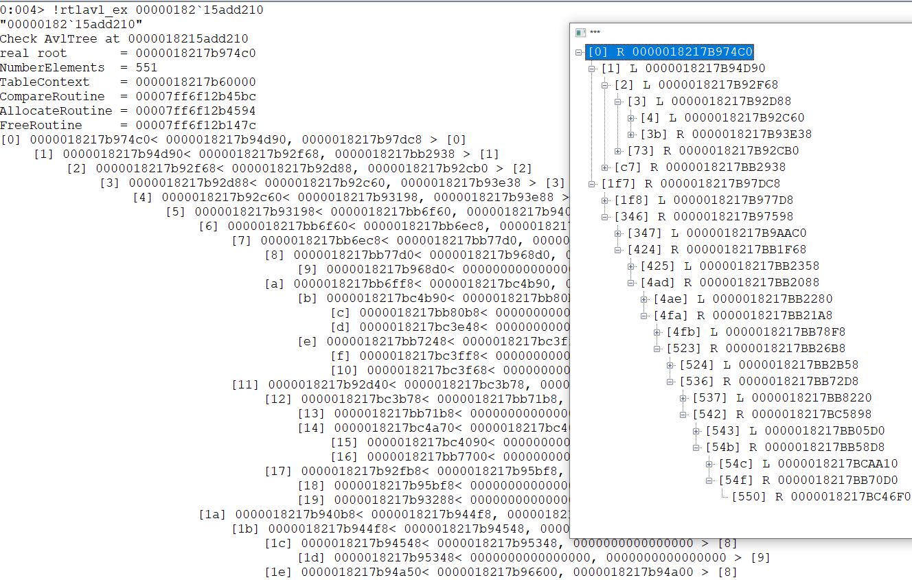

# rtlavl

ksupnd.dll is DbgEng Extension DLL
put it in Debuggers\x64\winext\ 

use .load avlex and .unload avlex inside windbg

!rtlavl_ex Address

displays the entries of an RTL_AVL_TABLE structure at Address 

 
